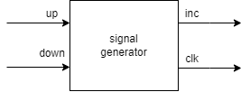

### Enunciado 
Implementar la FSM de Mealy para un contador del 0 al 100. La FSM tiene dos entradas, 'directionup' y 'directiondown', que si hay una transición de 1 a 0 (o se suelta el botón), define si el conteo está aumentando o disminuyendo"

### Mealy transitions


### Counter Construction

#### signal_generator
Es un componente del circuito que se encarga de generar dos señales diferentes: una señal de clock (reloj) y una señal de "who". La señal de clock es una señal de sincronización que se utiliza para sincronizar los diferentes elementos del circuito y asegurarse de que funcionen en sincronía. Por otro lado, la señal de "who" es una señal que se utiliza para indicar al autómata qué símbolo debe leer a continuación.



#### output_logic
Es un componente del circuito que tiene la función de tomar dos entradas: la señal de "who" y el estado actual del autómata, y utilizar esta información para calcular y producir una salida en formato BCD.


#### automata
Es un componente del circuito que actúa como un contador. Este autómata recibe un símbolo de entrada, y utiliza su "función de transición" para determinar cómo debe cambiar su estado interno en respuesta a ese símbolo.


#### counter
En este contexto, el "counter" es un componente del circuito que encapsula todos los módulos anteriores (Signal generator, autómata y Output logic) para crear la "máquina de Mealy" completa.

El módulo counter coordina y sincroniza todos los módulos previos para asegurarse de que el circuito funcione de manera coherente y produzca la salida deseada. En otras palabras, el módulo counter es el responsable de tomar la entrada de los botones y generar la salida en formato BCD en el display de 7 segmentos.


### Simulation


### Code
#### signal_generator.v
```verilog
module signal_generator(input wire up,
                        input wire down,
                        output reg inc = 0,
                        output reg clk = 0);

    // on falling edge of button up, inc = 1, clk -> 1 -> 0
    // on falling edge of button down, inc = 0, clk -> 1 -> 0
    always @(negedge up) begin
        inc = 1;
        clk = 1;
        #1
        clk = 0;
        inc = 0;
    end
    always@(negedge down) begin
        inc = 0;
        clk = 1;
        #1
        clk = 0;
        inc = 0;
    end
endmodule
```

#### automaton.v
```verilog
module automaton(input wire clock,
               input wire reset,
               input wire who,
               output wire [3:0] hundreds,
               output wire [3:0] tens,
               output wire [3:0] units
               );
    reg [6:0] state;

    output_logic output_l(.current(state),.who(who),.digit1(units),.digit2(tens),.digit3(hundreds));

    always @(reset)
    begin
        state = 0;
    end

    always @(posedge clock)
    begin
        case (who)
            1: 
            begin
                //incrementar
                if (state == 100)
                    state = state; // mantenerlo
                else
                     state = state + 1;
            end
            default: 
            begin
                //decrementar
                if (state == 0)
                    state = state; // mantenerlo
                else
                    state = state - 1;
            end
        endcase
    end


endmodule
```

#### output_logic.v
```verilog
module output_logic(input wire [6:0] current,
                 input wire who,
                 output reg [3:0] digit1, //less sign
                 output reg [3:0] digit2,
                 output reg [3:0] digit3);

    reg[6:0] next;
    always @(current) begin
        
        case (who)
            1: 
            begin
                //incrementar
                if (current == 100)
                    next = current; // mantenerlo
                else
                     next = current + 1;
            end
            default: 
            begin
                //decrementar
                if (current == 0)
                    next = current; // mantenerlo
                else
                     next = current - 1;
            end
        endcase

        // ahora viene lo bueno

        case (next)
            000:
            begin
                digit1 = 0; //less signigicant
                digit2 = 0;
                digit3 = 0;
            end
            001:
            begin
                digit1 = 1; //less signigicant
                digit2 = 0;
                digit3 = 0;
            end
            002:
            begin
                digit1 = 2; //less signigicant
                digit2 = 0;
                digit3 = 0;
            end
            003:
            begin
                digit1 = 3; //less signigicant
                digit2 = 0;
                digit3 = 0;
            end
            004:
            begin
                digit1 = 4; //less signigicant
                digit2 = 0;
                digit3 = 0;
            end
            005:
            begin
                digit1 = 5; //less signigicant
                digit2 = 0;
                digit3 = 0;
            end
            006:
            begin
                digit1 = 6; //less signigicant
                digit2 = 0;
                digit3 = 0;
            end
            007:
            begin
                digit1 = 7; //less signigicant
                digit2 = 0;
                digit3 = 0;
            end
            008:
            begin
                digit1 = 8; //less signigicant
                digit2 = 0;
                digit3 = 0;
            end
            009:
            begin
                digit1 = 9; //less signigicant
                digit2 = 0;
                digit3 = 0;
            end
            010:
            begin
                digit1 = 0; //less signigicant
                digit2 = 1;
                digit3 = 0;
            end
            011:
            begin
                digit1 = 1; //less signigicant
                digit2 = 1;
                digit3 = 0;
            end
            012:
            begin
                digit1 = 2; //less signigicant
                digit2 = 1;
                digit3 = 0;
            end
            013:
            begin
                digit1 = 3; //less signigicant
                digit2 = 1;
                digit3 = 0;
            end
            014:
            begin
                digit1 = 4; //less signigicant
                digit2 = 1;
                digit3 = 0;
            end
            015:
            begin
                digit1 = 5; //less signigicant
                digit2 = 1;
                digit3 = 0;
            end
            016:
            begin
                digit1 = 6; //less signigicant
                digit2 = 1;
                digit3 = 0;
            end
            017:
            begin
                digit1 = 7; //less signigicant
                digit2 = 1;
                digit3 = 0;
            end
            018:
            begin
                digit1 = 8; //less signigicant
                digit2 = 1;
                digit3 = 0;
            end
            019:
            begin
                digit1 = 9; //less signigicant
                digit2 = 1;
                digit3 = 0;
            end
            020:
            begin
                digit1 = 0; //less signigicant
                digit2 = 2;
                digit3 = 0;
            end
            021:
            begin
                digit1 = 1; //less signigicant
                digit2 = 2;
                digit3 = 0;
            end
            022:
            begin
                digit1 = 2; //less signigicant
                digit2 = 2;
                digit3 = 0;
            end
            023:
            begin
                digit1 = 3; //less signigicant
                digit2 = 2;
                digit3 = 0;
            end
            024:
            begin
                digit1 = 4; //less signigicant
                digit2 = 2;
                digit3 = 0;
            end
            025:
            begin
                digit1 = 5; //less signigicant
                digit2 = 2;
                digit3 = 0;
            end
            026:
            begin
                digit1 = 6; //less signigicant
                digit2 = 2;
                digit3 = 0;
            end
            027:
            begin
                digit1 = 7; //less signigicant
                digit2 = 2;
                digit3 = 0;
            end
            028:
            begin
                digit1 = 8; //less signigicant
                digit2 = 2;
                digit3 = 0;
            end
            029:
            begin
                digit1 = 9; //less signigicant
                digit2 = 2;
                digit3 = 0;
            end
            030:
            begin
                digit1 = 0; //less signigicant
                digit2 = 3;
                digit3 = 0;
            end
            031:
            begin
                digit1 = 1; //less signigicant
                digit2 = 3;
                digit3 = 0;
            end
            032:
            begin
                digit1 = 2; //less signigicant
                digit2 = 3;
                digit3 = 0;
            end
            033:
            begin
                digit1 = 3; //less signigicant
                digit2 = 3;
                digit3 = 0;
            end
            034:
            begin
                digit1 = 4; //less signigicant
                digit2 = 3;
                digit3 = 0;
            end
            035:
            begin
                digit1 = 5; //less signigicant
                digit2 = 3;
                digit3 = 0;
            end
            036:
            begin
                digit1 = 6; //less signigicant
                digit2 = 3;
                digit3 = 0;
            end
            037:
            begin
                digit1 = 7; //less signigicant
                digit2 = 3;
                digit3 = 0;
            end
            038:
            begin
                digit1 = 8; //less signigicant
                digit2 = 3;
                digit3 = 0;
            end
            039:
            begin
                digit1 = 9; //less signigicant
                digit2 = 3;
                digit3 = 0;
            end
            040:
            begin
                digit1 = 0; //less signigicant
                digit2 = 4;
                digit3 = 0;
            end
            041:
            begin
                digit1 = 1; //less signigicant
                digit2 = 4;
                digit3 = 0;
            end
            042:
            begin
                digit1 = 2; //less signigicant
                digit2 = 4;
                digit3 = 0;
            end
            043:
            begin
                digit1 = 3; //less signigicant
                digit2 = 4;
                digit3 = 0;
            end
            044:
            begin
                digit1 = 4; //less signigicant
                digit2 = 4;
                digit3 = 0;
            end
            045:
            begin
                digit1 = 5; //less signigicant
                digit2 = 4;
                digit3 = 0;
            end
            046:
            begin
                digit1 = 6; //less signigicant
                digit2 = 4;
                digit3 = 0;
            end
            047:
            begin
                digit1 = 7; //less signigicant
                digit2 = 4;
                digit3 = 0;
            end
            048:
            begin
                digit1 = 8; //less signigicant
                digit2 = 4;
                digit3 = 0;
            end
            049:
            begin
                digit1 = 9; //less signigicant
                digit2 = 4;
                digit3 = 0;
            end
            050:
            begin
                digit1 = 0; //less signigicant
                digit2 = 5;
                digit3 = 0;
            end
            051:
            begin
                digit1 = 1; //less signigicant
                digit2 = 5;
                digit3 = 0;
            end
            052:
            begin
                digit1 = 2; //less signigicant
                digit2 = 5;
                digit3 = 0;
            end
            053:
            begin
                digit1 = 3; //less signigicant
                digit2 = 5;
                digit3 = 0;
            end
            054:
            begin
                digit1 = 4; //less signigicant
                digit2 = 5;
                digit3 = 0;
            end
            055:
            begin
                digit1 = 5; //less signigicant
                digit2 = 5;
                digit3 = 0;
            end
            056:
            begin
                digit1 = 6; //less signigicant
                digit2 = 5;
                digit3 = 0;
            end
            057:
            begin
                digit1 = 7; //less signigicant
                digit2 = 5;
                digit3 = 0;
            end
            058:
            begin
                digit1 = 8; //less signigicant
                digit2 = 5;
                digit3 = 0;
            end
            059:
            begin
                digit1 = 9; //less signigicant
                digit2 = 5;
                digit3 = 0;
            end
            060:
            begin
                digit1 = 0; //less signigicant
                digit2 = 6;
                digit3 = 0;
            end
            061:
            begin
                digit1 = 1; //less signigicant
                digit2 = 6;
                digit3 = 0;
            end
            062:
            begin
                digit1 = 2; //less signigicant
                digit2 = 6;
                digit3 = 0;
            end
            063:
            begin
                digit1 = 3; //less signigicant
                digit2 = 6;
                digit3 = 0;
            end
            064:
            begin
                digit1 = 4; //less signigicant
                digit2 = 6;
                digit3 = 0;
            end
            065:
            begin
                digit1 = 5; //less signigicant
                digit2 = 6;
                digit3 = 0;
            end
            066:
            begin
                digit1 = 6; //less signigicant
                digit2 = 6;
                digit3 = 0;
            end
            067:
            begin
                digit1 = 7; //less signigicant
                digit2 = 6;
                digit3 = 0;
            end
            068:
            begin
                digit1 = 8; //less signigicant
                digit2 = 6;
                digit3 = 0;
            end
            069:
            begin
                digit1 = 9; //less signigicant
                digit2 = 6;
                digit3 = 0;
            end
            070:
            begin
                digit1 = 0; //less signigicant
                digit2 = 7;
                digit3 = 0;
            end
            071:
            begin
                digit1 = 1; //less signigicant
                digit2 = 7;
                digit3 = 0;
            end
            072:
            begin
                digit1 = 2; //less signigicant
                digit2 = 7;
                digit3 = 0;
            end
            073:
            begin
                digit1 = 3; //less signigicant
                digit2 = 7;
                digit3 = 0;
            end
            074:
            begin
                digit1 = 4; //less signigicant
                digit2 = 7;
                digit3 = 0;
            end
            075:
            begin
                digit1 = 5; //less signigicant
                digit2 = 7;
                digit3 = 0;
            end
            076:
            begin
                digit1 = 6; //less signigicant
                digit2 = 7;
                digit3 = 0;
            end
            077:
            begin
                digit1 = 7; //less signigicant
                digit2 = 7;
                digit3 = 0;
            end
            078:
            begin
                digit1 = 8; //less signigicant
                digit2 = 7;
                digit3 = 0;
            end
            079:
            begin
                digit1 = 9; //less signigicant
                digit2 = 7;
                digit3 = 0;
            end
            080:
            begin
                digit1 = 0; //less signigicant
                digit2 = 8;
                digit3 = 0;
            end
            081:
            begin
                digit1 = 1; //less signigicant
                digit2 = 8;
                digit3 = 0;
            end
            082:
            begin
                digit1 = 2; //less signigicant
                digit2 = 8;
                digit3 = 0;
            end
            083:
            begin
                digit1 = 3; //less signigicant
                digit2 = 8;
                digit3 = 0;
            end
            084:
            begin
                digit1 = 4; //less signigicant
                digit2 = 8;
                digit3 = 0;
            end
            085:
            begin
                digit1 = 5; //less signigicant
                digit2 = 8;
                digit3 = 0;
            end
            086:
            begin
                digit1 = 6; //less signigicant
                digit2 = 8;
                digit3 = 0;
            end
            087:
            begin
                digit1 = 7; //less signigicant
                digit2 = 8;
                digit3 = 0;
            end
            088:
            begin
                digit1 = 8; //less signigicant
                digit2 = 8;
                digit3 = 0;
            end
            089:
            begin
                digit1 = 9; //less signigicant
                digit2 = 8;
                digit3 = 0;
            end
            090:
            begin
                digit1 = 0; //less signigicant
                digit2 = 9;
                digit3 = 0;
            end
            091:
            begin
                digit1 = 1; //less signigicant
                digit2 = 9;
                digit3 = 0;
            end
            092:
            begin
                digit1 = 2; //less signigicant
                digit2 = 9;
                digit3 = 0;
            end
            093:
            begin
                digit1 = 3; //less signigicant
                digit2 = 9;
                digit3 = 0;
            end
            094:
            begin
                digit1 = 4; //less signigicant
                digit2 = 9;
                digit3 = 0;
            end
            095:
            begin
                digit1 = 5; //less signigicant
                digit2 = 9;
                digit3 = 0;
            end
            096:
            begin
                digit1 = 6; //less signigicant
                digit2 = 9;
                digit3 = 0;
            end
            097:
            begin
                digit1 = 7; //less signigicant
                digit2 = 9;
                digit3 = 0;
            end
            098:
            begin
                digit1 = 8; //less signigicant
                digit2 = 9;
                digit3 = 0;
            end
            099:
            begin
                digit1 = 9; //less signigicant
                digit2 = 9;
                digit3 = 0;
            end
            100:
            begin
                digit1 = 0; //less signigicant
                digit2 = 0;
                digit3 = 1;
            end

            default:
            begin
                digit1 = 14; // 0xE
                digit2 = 14;
                digit3 = 14;
            end
        endcase
    end
endmodule
```

#### counter.v
```verilog
module counter(input wire up, input wire down, input wire reset,
               output wire[3:0] units, output wire[3:0] tens, output wire[3:0] hundreds);

    wire clk;
    wire who;

    signal_generator siggen(.up(up),.down(down),.inc(who),.clk(clk));
    automaton autom(clk,reset,who,hundreds,tens,units);

endmodule
```