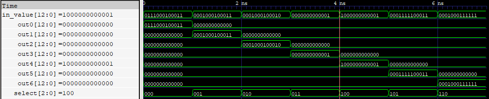
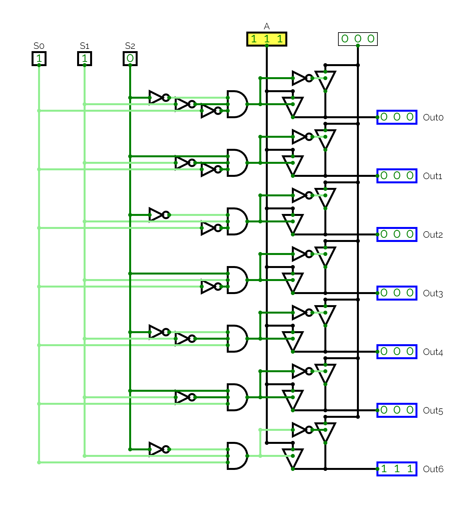
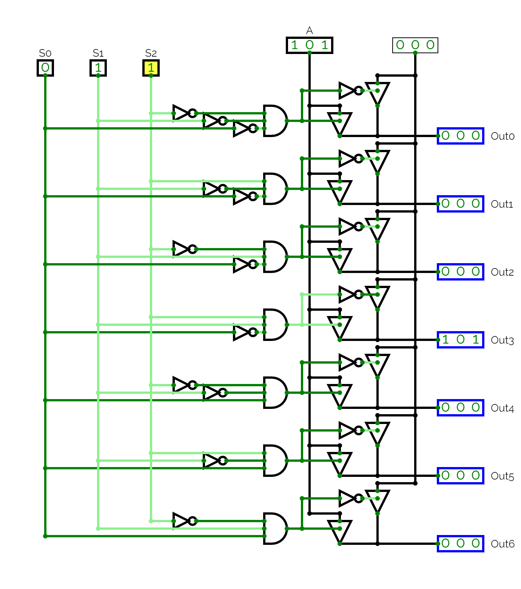

## Pregunta 3

### Demux design

Para el proceso de diseño se contará con un selector de 3 bits, el cual permitirá seleccionar un rango de valores desde 3'b000 hasta 3'b110. En este contexto, la entrada del diseño, A, constará de un total de 13 bits, y se obtendrán salidas con el mismo tamaño que la entrada.

| S0 | S1 | S2 | Input | out0 | out1 | out2 | out3 | out4 | out5 | out6 |
| :-:| :-:| :-:| :-:| :-:| :-:| :-:| :-:| :-:| :-:| :-:|
| 0 | 0 | 0 | A | A | 0 | 0 | 0 | 0 | 0 | 0 |
| 0 | 0 | 1 | A | 0 | A | 0 | 0 | 0 | 0 | 0 |
| 0 | 1 | 0 | A | 0 | 0 | A | 0 | 0 | 0 | 0 |
| 0 | 1 | 1 | A | 0 | 0 | 0 | A | 0 | 0 | 0 |
| 1 | 0 | 0 | A | 0 | 0 | 0 | 0 | A | 0 | 0 |
| 1 | 0 | 1 | A | 0 | 0 | 0 | 0 | 0 | A | 0 |
| 1 | 1 | 0 | A | 0 | 0 | 0 | 0 | 0 | 0 | A |


### Verilog code

#### demux13_7.v

El código describe un módulo de demultiplexor con una entrada de 13 bits y 7 salidas de igual tamaño, donde la salida seleccionada está controlada por un selector de 3 bits. La asignación de valores a las salidas se realiza mediante una estructura de selección "case" basada en el valor del selector.

```verilog
module demux13_7(out0,out1,out2,out3,out4,out5,out6,select,in_value);
output reg [12:0] out0, out1, out2, out3, out4, out5, out6;
input [2:0]select;
input [12:0]in_value;

always @(*)
    begin 
        out0=0;out1=0;out2=0;out3=0;out4=0;out5=0;out6=0;
        case(select)
            3'd0: out0=in_value;
            3'd1: out1=in_value;
            3'd2: out2=in_value;
            3'd3: out3=in_value;
            3'd4: out4=in_value;
            3'd5: out5=in_value;
            3'd6: out6=in_value;
        endcase
    end
endmodule
```

#### demux13_7_tb.v

El código describe un testbench para el módulo demultiplexor "demux13_7". El testbench establece valores para la entrada "in_value" y el selector "select" y luego muestra las salidas correspondientes "out0" a "out6" en función del valor seleccionado. La simulación se realiza utilizando la función "$display", que muestra los valores en la consola. El testbench también incluye una función "$dumpfile" y "$dumpvars" para generar un archivo VCD que puede ser utilizado para la visualización de la simulación.

```verilog
`timescale 1ns / 1ns

module demux13_7_tb;

    wire [12:0] out0, out1, out2, out3, out4, out5, out6;
    reg [2:0]select;
    reg [12:0]in_value;

    demux13_7 demux_test(.out0(out0),.out1(out1),.out2(out2),.out3(out3),.out4(out4),.out5(out5),.out6(out6),.select(select),.in_value(in_value));

    initial begin;
    in_value=13'b0111000100011; select = 3'b000;
    $display ("input=%b, select=%b, out=%b",in_value,select,out0);
    #1
    in_value=13'b0001000100011; select = 3'b001;
    $display ("input=%b, select=%b, out=%b",in_value,select,out1);
    #1
    in_value=13'b0001000100010; select = 3'b010;
    $display ("input=%b, select=%b, out=%b",in_value,select,out2);
    #1
    in_value=13'b0000000000001; select = 3'b011;
    $display ("input=%b, select=%b, out=%b",in_value,select,out3);
    #1
    in_value=13'b1000000000001; select = 3'b100;
    $display ("input=%b, select=%b, out=%b",in_value,select,out4);
    #1
    in_value=13'b0001111100011; select = 3'b101;
    $display ("input=%b, select=%b, out=%b",in_value,select,out5);
    #1
    in_value=13'b0001000111111; select = 3'b110;
    $display ("input=%b, select=%b, out=%b",in_value,select,out6);
    #1
    $finish;
    end

    initial begin
    $dumpfile("demux13_8.vcd");
    $dumpvars;
    end

endmodule
```
### Simulation and synthesis
#### Simulation
Durante el proceso de simulación, se evaluaron diversos valores de entrada en conjunción con el selector, y se pudo constatar que todas las compuertas del circuito funcionan de manera correcta y acorde a las especificaciones del diseño.



#### Synthesis

Se ha implementado el módulo demux13_7 utilizando compuertas lógicas, logrando un funcionamiento similar al modelo descrito en Verilog. Para facilitar la visualización e interpretación del diseño, se ha utilizado un tamaño de 3 bits tanto para la entrada como para las salidas, sin embargo, este diseño se puede adaptar a distintos tamaños (13 bits).




